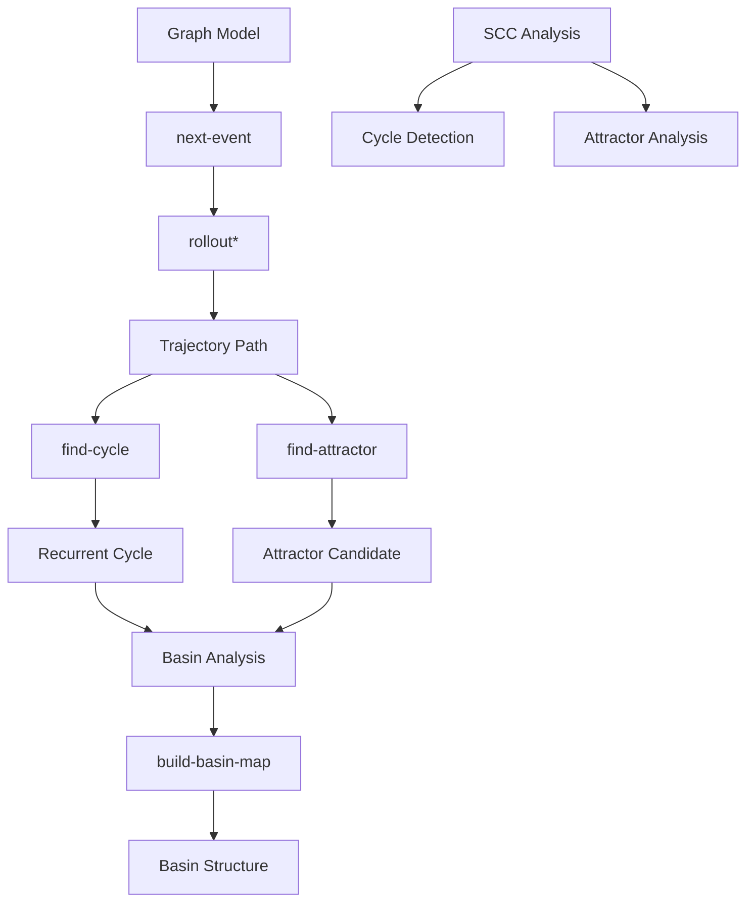

# Chron‑LLM 統合仕様書 v0.2

## 1. 全体構造マップ

### 1.1 モジュール一覧と階層関係

```
Chron-LLM Causal Dynamics Architecture v0.2
│
├── Phase-E Trace Analysis Layer (上位層)
│   ├── Graph Runtime (状態遷移グラフ生成)
│   └── Event Stream → Trajectory 変換
│
├── Topology Analysis Layer (scc.md)
│   ├── SCC 解析：mutual reachability の抽出
│   └── Attractor Candidate の特定
│
├── Dynamics Execution Layer (dynamics.md)
│   ├── next-event: トークン選択/遷移決定
│   ├── rollout*: 状態遷移列の生成
│   └── Trajectory Path の構築
│
├── Cycle Detection Layer (cycle.md)
│   ├── find-cycle: 末尾再帰サイクル抽出
│   └── find-recurrent-cycle: モード循環検出
│
└── Basin Analysis Layer (basin.md)
    ├── build-basin-map: attractor → basin 対応構築
    └── build-basin-structure: 収束領域統計構造生成
```

### 1.2 依存関係グラフ



---

## 2. 共通データ構造定義（Lisp）

### 2.1 Graph Model

```lisp
;; ノード構造 (各状態/トークンに対応)
(defstruct node
  id      ; ノード識別子 (unique identifier)
  role    ; reply / temporal / bridge
  timestamp) ; 時間スタンプ（ Chron-OS 対応）

;; エッジ構造 (遷移関係)
(defstruct edge
  from        ; 出発ノード ID
  to          ; 到達ノード ID
  relation    ; reply / temporal / bridge
  strength    ; 遷移の強度 (確率・重み 0.0-1.0)
  count       ; 発生頻度 counter)

;; グラフ構造 (全体状態空間)
(defstruct graph
  nodes     ; (list of node)
  edges     ; (list of edge)
  clusters  ; クラスター情報 (A/B/C cluster)
  metadata) ; version, created_at, etc.
```

### 2.2 Dynamics Structures

```lisp
;; rollout 実行結果 (Trajectory Path)
(defstruct trajectory-path
  start-node      ; 開始ノード ID
  steps           ; 遷移回数
  path            ; (list of node-id) 遷移経路
  terminal-node   ; 終端ノード
  detected-cycle  ; 検出されたサイクル（あれば）
  attractor       ; 収束先アトラクター）

;; next-event 選択結果
(defstruct event-selection
  current-node    ; 現在ノード ID
  selected-edge   ; 選択されたエッジ
  strength        ; 遷移強度
  alternatives    ; 他の候補 (for analysis)
```

### 2.3 Cycle Structures

```lisp
;; 再帰サイクル構造
(defstruct recurrent-cycle
  cycle-id        ; サイクル識別子
  nodes           ; (list of node-id) サイクル構成ノード
  length          ; サイクル長さ (ステップ数)
  frequency       ; 発生頻度
  stability       ; 安定性スコア（再出現率）
  attractor-type  ; reply-cluster / temporal-bridge)

;; Cycle Detection Result
(defstruct cycle-detection-result
  cycles          ; (list of recurrent-cycle)
  is-periodic     ; 周期性判定 (boolean)
  period-length   ; 周期長
```

### 2.4 SCC Structures

```lisp
;; 強連結成分構造
(defstruct scc-component
  component-id    ; コンポーネント識別子
  nodes           ; (list of node-id) 所属ノード
  reachability    ; mutual reachability 情報
  is-attractor    ; attractor と同一かどうか（false）
  stable-dynamics ; 安定再生成性 flag)

;; SCC Analysis Result
(defstruct scc-analysis-result
  components      ; (list of scc-component)
  graph-connectedness ; グラフの連結度スコア
```

### 2.5 Basin Structures

```lisp
;; アトラクター構造
(defstruct attractor
  attractor-id    ; 識別子 (cycle / terminal-point)
  type            ; cycle / fixed-point
  nodes           ; (list of node-id) 代表ノード
  stability       ; 安定性スコア
  recurrence      ; 再帰頻度

;; バスイン構造（引き込み領域）
(defstruct basin
  attractor       ; (attractor) 収束先アトラクター
  nodes           ; (list of node-id) 所属ノード
  mass            ; size (ノード数)
  ratio           ; 全体に対する割合 (0.0-1.0)
  coverage-area   ; 状態空間カバー範囲

;; Basin Analysis Result
(defstruct basin-analysis-result
  basins          ; (list of basin)
  total-attractors ; 総アトラクター数
  convergence-rate; 収束率統計
```

### 2.6 Cluster Structures（3cluster モデル）

```lisp
;; クラスター構造
(defstruct cluster
  cluster-id      ; A / B / C など
  type            ; reply-cluster / temporal-cluster / bridge-cluster
  nodes           ; (list of node-id) 所属ノード
  connections     ; 他のクラスターへの遷移エッジ
  stability       ; クラスター安定性スコア

;; 3-Cluster Graph Example
(defstruct three-cluster-graph
  cluster-a       ; (cluster) reply cluster(強い循環)
  cluster-b       ; (cluster) temporal cluster(弱い循環)
  cluster-c       ; (cluster) bridge cluster(A/Bを接続)
```

---

## 3. 各モジュールの責務境界と入出力仕様

### 3.1 scc.md（強連結成分解析）

| 項目 | 仕様 |
|------|------|
| **責務** | グラフ内の mutual reachability を抽出し、SCC を特定 |
| **入力** | Graph, nodes (list of node-id) |
| **出力** | scc-analysis-result (components, connectedness score) |
| **依存** | graph.md（Graph Model） |
| **非同期性** | SCC ≠ Attractor（SCC は mutual reachability、Attractor は stable recurrent dynamics）[1] |

### 3.2 dynamics.md（状態遷移・力学系）

| 項目 | 仕様 |
|------|------|
| **責務** | Graph Runtime の State Transition Executor として動作 |
| **入力** | Node, Event, Transition Rule |
| **出力** | Trajectory Path (rollout path) |
| **依存** | graph.md（Graph Model） |
| **Chron-OS 対応** | World State → Node / Event → Edge / Execution Trace → rollout path[2] |

### 3.3 cycle.md（周期軌道検出）

| 項目 | 仕様 |
|------|------|
| **責務** | rollout trajectory の終端周期を検出し、再帰的構造を抽出 |
| **入力** | Trajectory Path (rollout path) |
| **出力** | recurrent-cycle, is-periodic flag |
| **依存** | dynamics.md（Trajectory Path） |
| **機能** | `find-cycle` / `find-recurrent-cycle` プリミティブ[3] |

### 3.4 basin.md（引き込み領域解析）

| 項目 | 仕様 |
|------|------|
| **責務** | attractor への収束構造を解析し、各アトラクターの吸引領域を特定 |
| **入力** | Graph, Nodes, Transition depth, Attractor candidates |
| **出力** | basin objects (attractor, nodes, mass, ratio) |
| **依存** | cycle.md（Recurrent Cycle）、dynamics.md（Trajectory Path） |
| **特性** | deterministic / observational / non-authoritative / replay-compatible[5] |

### 3.5 3cluster.md（クラスタリングモデル）

| 項目 | 仕様 |
|------|------|
| **責務** | A/B/C の3クラスターを持つ検証用 Graph モデル |
| **入力** | None (static model definition) |
| **出力** | Expected attractor candidates (A cycle, B cycle) |
| **依存** | graph.md（Graph Model） |
| **用途** | Runtime state graph / Event transition graph / Worldline graph の検証[6] |

---

## 4. 未確定仕様・補完が必要な箇所

### 4.1 技術的曖昧点

| ID | 問題点 | 推奨対応 | 優先度 |
|----|--------|----------|--------|
| **U001** | `rollout*` の終了条件が明記されていない（max steps? convergence threshold?） | max-steps と convergence-threshold の両方をサポートする仕様を追加 | High |
| **U002** | `find-attractor` が返す "terminal node" の定義が不明（単一ノード？サイクル？） | attractor-type (cycle/fixed-point) を明確化し、cycle-candidate も含める | High |
| **U003** | Basin analysis の `mass` と `ratio` の計算基準が未定義（ノード数？遷移頻度？） | mass = node count, ratio = basin_nodes / total_nodes と規定 | Medium |
| **U004** | SCC と Attractor の区別は明記されているが、SCC が Attractor に変換される条件が不明 | SCC → Attractor 変換の閾値（stability score threshold）を定義 | Medium |

### 4.2 Chron-OS Mapping 補完

| ID | 問題点 | 推奨対応 | 優先度 |
|----|--------|----------|--------|
| **U005** | Chron-OS のどのレイヤーに相当するか、一部のモジュールで不明確 | Topology Analysis Layer / State Transition Executor / Basin Structure Analysis Layer を統一仕様へ明記 | Medium |
| **U006** | Phase-E Trace Analysis 層との接続仕様が断片的 | IR Stream → Causal DSL → Kernel のパイプラインを統合ドキュメントに追加 | High |

### 4.3 データ構造の不足

| ID | 問題点 | 推奨対応 |
|----|--------|----------|
| **U007** | `transition depth` の計算方法が未定義（hops? time steps?） | transition-depth = number of rollout steps と規定 |
| **U008** | Cluster type (reply/temporal/bridge) の判定基準が不明 | reply: high recurrence rate / temporal: low stability / bridge: multi-cluster connections と定義 |
| **U009** | `stability score` の計算式が未明記 | stability = cycle_reappearance_rate / total_observations と規定 |

### 4.4 拡張性に関する課題

- [ ] **Cross-module consistency**: モジュール間で重複する関数（例：find-attractor が dynamics.md と basin.md で両方定義されている）の統合が必要
- [ ] **Error handling**: グラフが非連結、無限ループ、サイクル検出失敗時のフォールバック仕様未定義
- [ ] **Performance metrics**: 各解析モジュールの実行時間・メモリ使用量のメトリクス収集仕様未定義

---

## 5. 統合アーキテクチャ（最終版）

```
┌─────────────────────────────────────────────────────────────┐
│                    Chron-LLM Causal Kernel                  │
│                     (Phase E Trace Analysis)                │
└───────────────────┬─────────────────────────────────────────┘
                    │
        ┌───────────▼───────────┐
        │   Graph Runtime       │ ← IR Stream → Event Stream
        │   (State Transition)  │
        └───────┬───────────────┘
                │ rollout*
    ┌───────────▼───────────┐
    │   Trajectory Path     │
    └───────┬───────┬───────┘
            │       │
    ┌───────▼───┐ ┌─▼──────────┐
    │find-cycle │ │find-attractor│ ← SCC Analysis (parallel)
    └─────┬─────┘ └─────┬───────┘
          │             │
  ┌───────▼───────┐ ┌───▼────────┐
  │Recurrent Cycle│ │Attractor   │
  │               │ │Candidate   │
  └───────┬───────┘ └─────┬──────┘
          │               │
          └───────┬───────┘
                  ▼
        ┌─────────────────┐
        │ build-basin-map │
        └────────┬────────┘
                 ▼
        ┌─────────────────┐
        │Basin Structure  │ ← Output: attractor domains, convergence stats
        └─────────────────┘
```

---

## 6. 参考文献（ソース ID）

- [1] scc.md - SCC と Attractor の区別、Architectural Position
- [2] dynamics.md - Chron-OS Mapping (State Transition Executor), Basin Analysis flow
- [3] cycle.md - find-cycle / find-recurrent-cycle プリミティブ、Architectural Position
- [4] chron-llm-r1-dynamical-analysis-experiment-spec-v0.1.md - Graph Model, Dynamics, Cycle Detection, Basin Analysis の基本仕様
- [5] basin.md - Basin Structure Analysis Specification v1.0, Chron-LLM/Chron-OS Mapping
- [6] 3cluster.md - 3-Cluster compatibility, Expected attractor candidates

---

**作成日**: 2024  
**バージョン**: Integrated Specification v0.2  
**ステータス**: Experimental / Mathematical Foundation (Phase-E DSL Semantics Ready)